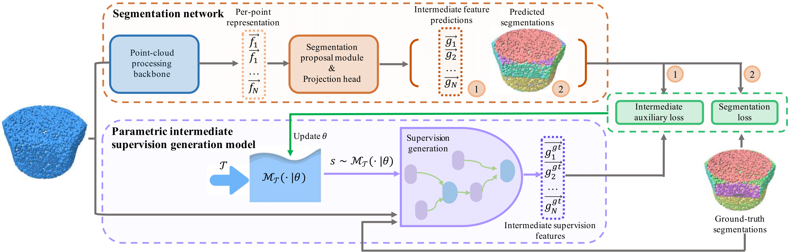

### AutoGPart: Intermediate Supervision Search for Generalizable 3D Part Segmentation

AutoGPart is a method that builds an intermediate supervision space to search from to improve the generalization ability of 3D part segmentation networks. 

This repository contains PyTorch implementation of our paper: 

[AutoGPart: Intermediate Supervision Search for Generalizable 3D Part Segmentation](https://arxiv.org/pdf/2203.06558.pdf), *Xueyi Liu*, *Xiaomeng Xu*, [*Anyi Rao*](https://anyirao.com), [*Chuang Gan*](https://people.csail.mit.edu/ganchuang/), [*Li Yi*](https://ericyi.github.io), CVPR 2022.



## Links

- [Project Page](https://autogpart.github.io) (including videos, visualizations for searched intermediate supervisions and segmentations)
- [arXiv Page](https://arxiv.org/abs/2203.06558)

## Environment and package dependency

The main experiments are implemented on PyTorch 1.9.1, Python 3.8.8. Main dependency packages are listed as follows:

```
torch_cluster==1.5.9
torch_scatter==2.0.7
horovod==0.23.0
pykdtree==1.3.4
numpy==1.20.1
h5py==2.8.0
```

## Supervision search stage

### Mobility-based part segmentation

To optimize the supervision distribution space for the mobility-based part segmentation task, please use the following command (single machine):

```shell
CUDA_VISIBLE_DEVICES=${devices} horovodrun -np ${n_device}  -H ${your_machine_ip}:${n_device} python -W ignore main_prm.py -c ./cfgs/motion_seg_h_mb_cross.yaml
```

for the default segmentation network with DGCNN backbone.

To test PointNet++ backbone, replace `use_dgcnn` in `./cfgs/motion_seg_h_mb_cross.yaml` from `True` to `False` and use the same command stated as above.

### Primitive fitting

To optimize the supervision distribution space for the primitive fitting task, please use the following command:

```shell
CUDA_VISIBLE_DEVICES=${devices} horovodrun -np ${n_device}  -H ${your_machine_ip}:${n_device} python -W ignore main_prm.py -c ./cfgs/prim_sea_h_mb_v2_tree.yaml
```

for the default segmentation network with DGCNN backbone.

To test PointNet++ backbone, replace `use_dgcnn` in `./cfgs/prim_sea_h_mb_v2_tree.yaml` from `True` to `False` and use the same command stated as above.

To optimize the supervision distribution space for the first learning stage of primitive fitting task using HPNet-style network architecture, please use the following command:

```shell
CUDA_VISIBLE_DEVICES=${devices} horovodrun -np ${n_device}  -H ${your_machine_ip}:${n_device} python -W ignore main_prm.py -c ./cfgs/prim_seg_h_mb_v2_tree_optim_loss.yaml
```

### Sample supervision features from the optimized supervision feature distribution space

Replace the `sv_params_path` variable in `load_and_sample.py` file to the path to saved distribution parameters (always have a name `dist_params.npy`). 

Then use the following command:

```shell
python load_and_sample.py -c cfgs/${your_config_file} --ty=loss
```

Sampled supervision features will be printed out on the screen.

### Greedy search for optimal supervison combinations

Replace the `beam_search` variable in the config file from `False` to `True` and use the following command three times to select the optimal supervision combination: 

```shell
CUDA_VISIBLE_DEVICES=${devices} horovodrun -np ${n_device}  -H ${your_machine_ip}:${n_device} python -W ignore main_prm.py -c ./cfgs/${your_config_file}
```

You need to modify the function `beam_searh_for_best` in each trainer file to guide the selection process according to the algorithm described in the supplementarty material.

## Regular training stage

After we have got the searched and selected supervision combination, modify the trainer file by plugging the selecte supervision combination into code lines. Then for each segmentation task: 

### Mobility-based part segmentation

Use the following command to evaluate the selected supervision features:

```shell
CUDA_VISIBLE_DEVICES=${devices} horovodrun -np ${n_device}  -H ${your_machine_ip}:${n_device} python -W ignore main_prm.py -c ./cfgs/motion_seg_h_ob_cross_tst_perf.yaml
```

### Primitive fitting

Use the following command to evaluate the selected supervision features:

```shell
CUDA_VISIBLE_DEVICES=${devices} horovodrun -np ${n_device}  -H ${your_machine_ip}:${n_device} python -W ignore main_prm.py -c ./cfgs/prim_seg_h_ob_v2_tree.yaml
```

## Inference stage

### Mobility-based part segmentation

Replace `resume` in motion_seg_inference to the path to saved model weights and use the following command to evaluate the trained model:

```shell
python -W ignore main_prm.py -c ./cfgs/motion_seg_inference.yaml
```

Remember to select a free gpu in the config file.

### Primitive fitting

Replace `resume` in `prim_inference.yaml` to the path to saved model weights and use the following command to evaluate the trained model:

```shell
python -W ignore main_prm.py -c ./cfgs/prim_inference.yaml
```

Remember to select a free gpu in the config file.

You should modify the file `prim_inference.py` to choose whether to use the clustering-based segmentation module or classification-based one.

For clustering-based segmentation, use `_clustering_test` function; For another, use `_test` function.

Remember to select a free gpu in the config file.

## Datasets

All data should be put under the folder `data`. 

### Mobility-based part segmentation

For the mobility-based part segmentation task, we collect the training dataset and the auxiliary training dataest from [1,2] respectively. We infer mobility meta-data heuristically for parts in each shape. Original datasets can be downloaded from [ShapeNetPart](https://shapenet.cs.stanford.edu/ericyi/shapenetcore_partanno_v0.zip) and [PartNet](https://www.shapenet.or).

The test dataset is the same as the one use in [3] (could be download via [PartMob](https://shapenet.cs.stanford.edu/ericyi/pretrained_model_partmob.zip)). To spare time, we use the trained flow estimation model to estimate flow for each shape and save the data with coordinate information. During the inference, we directly use the estimated flow.

### Primitive fitting

We use the same dataset as the one used in [4]. We re-split the dataset to better test the domain generalization ability of the model.

The dataset can be downloaded via [Traceparts](https://www.traceparts.com/) (original version). Put the file under `data/` folder and unzip it.

## Reference

Part of the code is taken from [HPNet](https://github.com/SimingYan/HPNet), [SPFN](https://github.com/lingxiaoli94/SPFN), [Deep Part Induction](https://github.com/ericyi/articulated-part-induction), [PointNet2](https://github.com/charlesq34/pointnet2), [MixStyle](https://github.com/KaiyangZhou/mixstyle-release).

## License

Our code and data are released under MIT License (see LICENSE file for details).


[1] Yi, L., Kim, V. G., Ceylan, D., Shen, I. C., Yan, M., Su, H., ... & Guibas, L. (2016). A scalable active framework for region annotation in 3d shape collections. *ACM Transactions on Graphics (ToG)*, *35*(6), 1-12.

[2] Mo, K., Zhu, S., Chang, A. X., Yi, L., Tripathi, S., Guibas, L. J., & Su, H. (2019). Partnet: A large-scale benchmark for fine-grained and hierarchical part-level 3d object understanding. In *Proceedings of the IEEE/CVF Conference on Computer Vision and Pattern Recognition* (pp. 909-918).

[3] Yi, L., Huang, H., Liu, D., Kalogerakis, E., Su, H., & Guibas, L. (2018). Deep part induction from articulated object pairs. *arXiv preprint arXiv:1809.07417*.

[4] Li, L., Sung, M., Dubrovina, A., Yi, L., & Guibas, L. J. (2019). Supervised fitting of geometric primitives to 3d point clouds. In *Proceedings of the IEEE/CVF Conference on Computer Vision and Pattern Recognition* (pp. 2652-2660).

